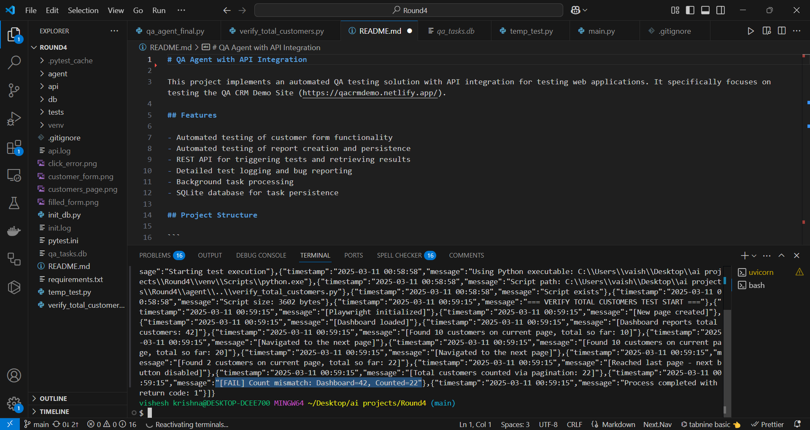
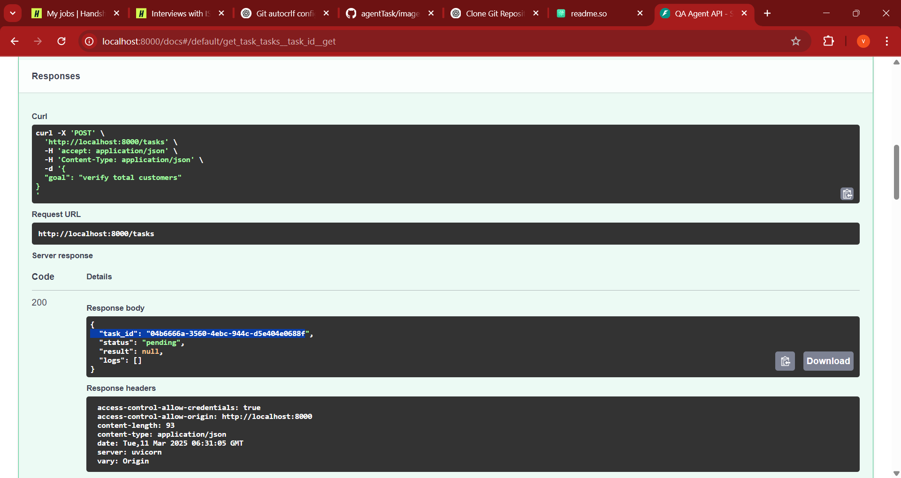
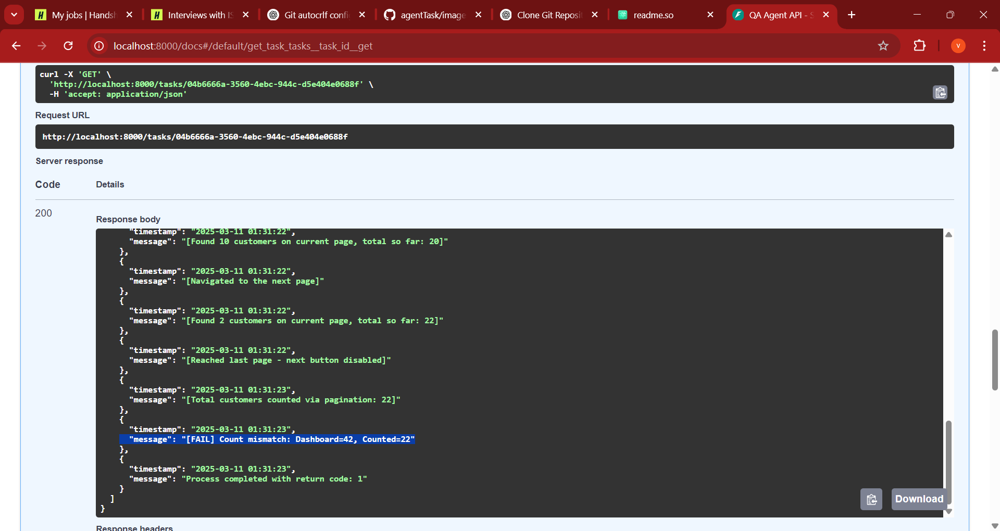
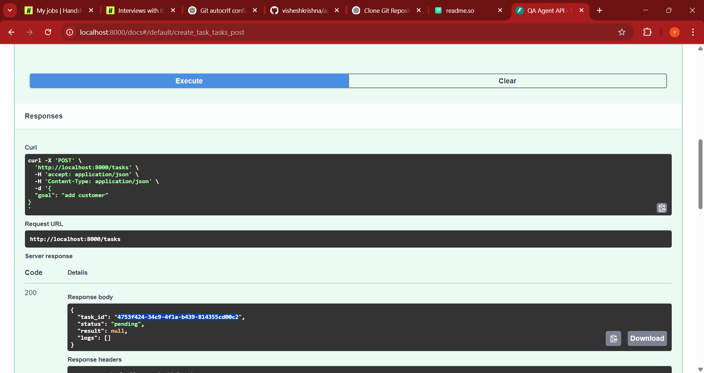
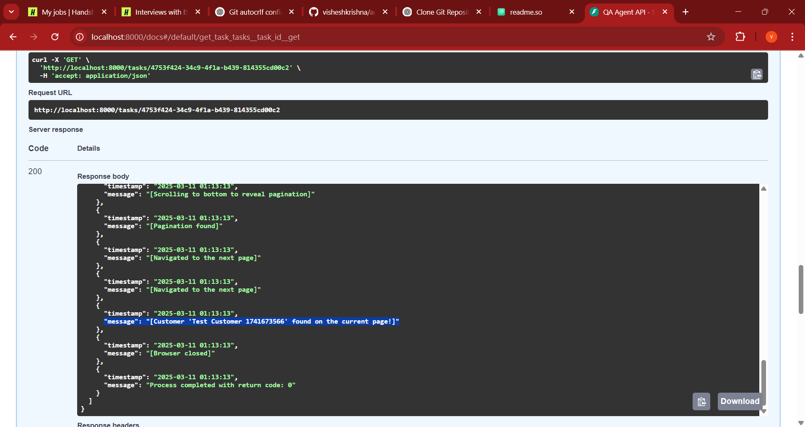

# QA Agent with API Integration

This project implements an automated QA testing solution with API integration for testing web applications. It specifically focuses on testing the QA CRM Demo Site (https://qacrmdemo.netlify.app/).

## Features

- Automated testing of customer form functionality
- Automated testing of report creation and persistence
- REST API for triggering tests and retrieving results
- Detailed test logging and bug reporting
- Background task processing
- SQLite database for task persistence

## Project Structure

```
.
├── api/
│   ├── __init__.py
│   └── main.py           # FastAPI application
├── agent/
│   ├── __init__.py
│   └── qa_agent.py       # QA testing logic
├── db/
│   ├── __init__.py
│   └── database.py       # Database operations
├── tests/               # Test files
├── requirements.txt     # Project dependencies
├── init_db.py          # Database initialization
└── README.md           # This file
```

## Setup

1. Clone the repository

```bash
git clone https://github.com/your-username/your-repository.git
cd your-repository
```

2. Create and activate a virtual environment:
For Windows users:
```bash
python -m venv venv
venv\Scripts\activate  # On Windows, use this to activate the virtual environment
```
For macOS/Linux users:
```bash
python3 -m venv venv
source venv/bin/activate  # This activates the virtual environment
```

3. Install dependencies:
```bash
pip install -r requirements.txt
playwright install  # Install browser binaries
```

4. Initialize the database:
```bash
python init_db.py
```

## Running the Application

1. Start the API server:
```bash
uvicorn api.main:app --reload
```

2. The API will be available at http://localhost:8000

## API Endpoints
## POST API CALL
## Testing if customer is added successfully
```bash
curl -X POST http://127.0.0.1:8000/tasks \
  -H "Content-Type: application/json" \
  -d '{"goal": "add customer"}'
```
#### Don't change the goal value to something else since the add customer is used to trigger the agent. Using other variable can lead to errors

#### Agent will automatically open the browser and perform the tasks on the website.

Once you run the command, you will get the "task_id" in the terminal. 
Copy the "task_id" and replace it with <taskid> in GET API call.

### Get Task Status
```bash
curl -X GET "http://127.0.0.1:8000/tasks/<TASK_ID>"
```

## Example Usage
```bash
curl -X GET "http://127.0.0.1:8000/tasks/123e4567-e89b-12d3-a456-426614174000"
```

## RESULT
The output of the task will be seen in the terminal as 
#### "[Customer 'Test Customer 1741670553' found on the current page!]"

This indicates that customer has been added successfully.


# BUG IDENTIFIED
## Testing for Total customers present on the dashboad is equal to toal customers in the list on https://qacrmdemo.netlify.app/customers page.
```bash
curl -X POST http://127.0.0.1:8000/tasks \
  -H "Content-Type: application/json" \
  -d '{"goal": "verify total customers"}'
```
#### Don't change the goal value to something else since the verrify total customer is used to trigger the agent. Using other variable can lead to errors

#### Agent will automatically open the browser and perform the tasks on the website.

Once you run the command, you will get the "task_id" in the terminal. 
Copy the "task_id" and replace it with <taskid> in GET API call.

### Get Task Status
```bash
curl -X GET "http://127.0.0.1:8000/tasks/<TASK_ID>"
```

## Example Usage
```bash
curl -X GET "http://127.0.0.1:8000/tasks/wefr44-e89b-12d3-a456-426614174000"
```

## RESULT
The output of the task will be seen in the terminal as 
#### "[FAIL] Count mismatch: Dashboard=42, Counted=22"

This indicates that total customer number is wrong.




# ANOTHER WAY OF TESTING
## BUG IDENTIFIED

### Running the Application

1. Start the API server:
```bash
uvicorn api.main:app --reload
```

2. Open the link on browser
```bash
http://localhost:8000/docs
```

3. Select POST/tasks click on "Try it out"
Navigate to Request Body and paste the below Code and click on generate. 
```bash
{
  "goal": "verify total customers"
}
```
Do not change the goal value

#### Agent will automatically open the browser and perform the tasks on the website.

task_id will be genereated in the server response and Copy the task_id


4. Select GET/tasks/{task_id} click on "Try it out"
Navigate to task-id. Paste the task_id and click on generate. 

In server response you will see that 
#### "[FAIL] Count mismatch: Dashboard=42, Counted=22"




### ADDING CUSTOMER
### Running the Application

1. Start the API server:
```bash
uvicorn api.main:app --reload
```

2. Open the link on browser
```bash
http://localhost:8000/docs
```

3. Select POST/tasks click on "Try it out"
Navigate to Request Body and paste the below Code and click on generate. 
```bash
{
  "goal": "add customer"
}
```
Do not change the goal value

#### Agent will automatically open the browser and perform the tasks on the website.

task_id will be genereate in the server response and Copy the task_id


4. Select GET/tasks/{task_id} click on "Try it out"
Navigate to task-id. Paste the task_id and click on generate. 

In server response you will see that 
#### "[Customer 'Test Customer 1741670553' found on the current page!]



